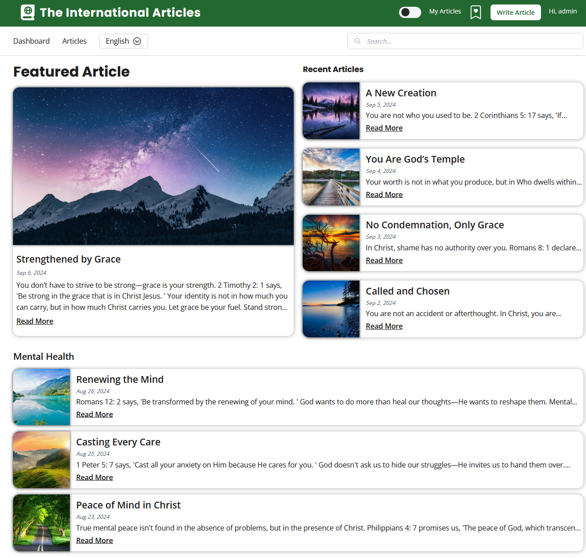

# The International Articles

Welcome to The International Articles project! This full-stack MERN (MongoDB, Express, React, Node.js) application allows you to view articles in multiple languages simultaneously, as well as write your own articles and use AI to generate translations. Follow the instructions below to set up the project locally on your machine.




## Prerequisites

Before you begin, ensure you have the following installed on your machine:

- **Docker Desktop**  ``` https://www.docker.com/products/docker-desktop/ ```

## Getting Started

1. **Clone the Repository:**

   First, clone the repository to your local machine using the following command:
   
   ```bash
   git clone https://github.com/MarshallNickolauson/the-international-articles.git
   ```

2. **Run Docker Compose:**

   Start Docker Desktop engine.
   In the root directory of the project run:
   
   ```bash
   docker-compose up --build -d
   ```

   **During first startup it will take a while to download the AI-powered translation models. Startup time is very fast when these are done.**

   To shutdown the project:
   
   ```bash
   docker-compose down
   ```

   To restart the project:
   
   ```bash
   docker-compose up -d
   ```


3. **Run Admin and Articles Seeder:**

   If you're starting the app for the first time, you can populate an admin with articles.
   
   In the root directory of the project run:
   
   ```bash
   docker-compose exec seeder node /app/seeder.js
   ```

4. **Open Your Browser:**

   Open your browser and go to:
   
   ```bash
   https://localhost
   ```

   **There will be a security warning that the page is unsecure. This is normal. The HTTPS certificates are self-generated for the sake of showcasing. This would not be the case in a real production environment.**
   
    **Click advanced in the webpage and proceed anyway to view the app.**

   You should see The International Articles application up and running!

6. **Admin Account:**

   If you ran the seeder command, you can log into the site as as admin with:
   ```
   email: 'admin@email.com'
   password: 'password'
   ```

   After doing this, navigate to "My Articles" to see the articles registered under this admin user.

   **You can interact with it completely and everything you do will be saved to the Docker Desktop volume.**
   **So when you restart the application, all your changes will persist :)**
